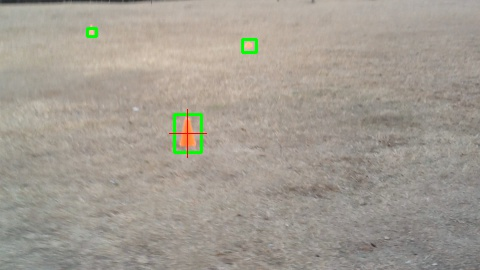

ardrone-object-trail
====================

Python code that allows an ardrone to follow a trail of colored objects (specifically orange cones)

Using this Code
--------------------

Currently, the code just draws boxes around the targets and crosshairs on the nearest (biggest) one.  Actually steering the drone towards the targets is still to come.  To try out what is up so far:
first, make sure you have opencv installed.  Next, download the code, and run it on a video of your targets.  
<pre><code>python cone_follow.py video_of_targets.mov</code></pre>
Right now, the project is coded to track orange objects.  The color range is very specific, so fiddle with the HSV color constants <code>ORANGE_MIN</code> and <code>ORANGE_MAX</code> till it picks up your targets.  Also adjust <code>MIN_P</code> and <code>MAX_P</code> (minimum and maximum perimeter for bounding boxes).  The code determines the nearest target by picking the largest one, so you need objects that are more or less the same size.  Enjoy!

